# Guide d'utilisation de lightProcess.sh

## Description

Le script `bin/lightProcess.sh` active le venv du projet puis appelle `bin/lightProcess.py`.
Il permet de traiter automatiquement des images light en effectuant :

1. **Détection automatique** des images light dans un répertoire de session
2. **Groupement** des images par caractéristiques communes (température, exposition, gain, caméra, binning)
3. **Recherche automatique** du master dark correspondant dans la librairie
4. **Prétraitement** avec soustraction du dark et application optionnelle d'un master flat
5. **Export des images calibrées** par sous-session
6. **Stacking final** des images calibrées quand une cible contient plusieurs sous-sessions

## Structure des répertoires attendue

```
session_directory/
├── light/                  # OBLIGATOIRE - Contient les images light
│   ├── image_001.fit
│   ├── image_002.fit
│   └── ...
└── flat/                   # OPTIONNEL - Utilisé pour créer un master flat
    ├── flat_001.fit
    └── ...
```

## Utilisation basique

```bash
# Traitement d'une session avec configuration par défaut
./bin/lightProcess.sh /path/to/session_M31

# Avec spécification de la librairie de darks
./bin/lightProcess.sh /path/to/session_M31 --dark-lib /path/to/dark_library

# Sans utilisation de master dark
./bin/lightProcess.sh /path/to/session_M31 --no-dark
```

## Options principales

### Répertoires
- `--dark-lib` : Chemin vers la librairie de master darks
- `--no-dark` : Désactive l'utilisation des master darks pendant la calibration
- `--output` : Répertoire de sortie (défaut: `~/SirilProcessed`)
- `--work-dir` : Répertoire de travail temporaire (défaut: `~/tmp/sirilWorkDir`)

### Traitement
- `--temperature-precision` : Précision de correspondance des températures en °C (défaut: 0.2)
- `--force` : Force le retraitement même si les fichiers de sortie existent
- `--dry-run` : Simule le traitement sans l'exécuter

### Siril
- `--siril-path` : Chemin vers l'exécutable Siril (défaut: siril)
- `--siril-mode` : Mode d'exécution (`native`, `flatpak`, `appimage`)

### Stacking
- `--stack-method` : Méthode de stacking (`average`, `median`, `sum`)
- `--rejection-method` : Méthode de rejet (`none`, `sigma`, `linear`, `winsor`, `percentile`)
- `--rejection-param1` : Seuil bas de rejet (défaut: 3.0)
- `--rejection-param2` : Seuil haut de rejet (défaut: 3.0)

## Schéma du processus

```mermaid
flowchart TD
    A["Entrée utilisateur<br/>session ou cible"] --> B{"Contient des sous-sessions ?"}
    B -->|Non| C["Session unique<br/>session/light et session/flat"]
    B -->|Oui| D["Cible multi-sessions<br/>cible/session_x/light et flat"]
    C --> E["Détection des lights<br/>groupement caméra/température/exposition/gain/binning"]
    D --> E
    E --> F["Recherche master dark light<br/>dark_library_path"]
    F --> G{"Flats compatibles ?"}
    G -->|Oui| H["work/<cible>/sessions/<session>/flat_<groupe><br/>liens vers flats source"]
    H --> I["work/<cible>/sessions/<session>/flat_process<br/>convert flat_<groupe>"]
    I --> J["calibrate flat_<groupe><br/>dark adapté au flat"]
    J --> K["master_flat_<groupe>.fit(s)<br/>stack pp_flat_<groupe>"]
    G -->|Non| L["Pas de master flat"]
    K --> M["work/<cible>/sessions/<session>/light_<groupe><br/>liens vers lights source"]
    L --> M
    M --> N["work/<cible>/sessions/<session>/process<br/>convert light_<groupe>"]
    N --> O["calibrate light_<groupe><br/>dark et master flat si disponible"]
    O --> P["Copie Python des seuls process/pp_light_*<br/>vers output/<cible>/sessions/<session>/<session>_<groupe>_calibrated"]
    P --> R0
    subgraph STACK["work/&lt;cible&gt;/stacking — étapes fixes"]
        R0["00_inputs/<br/>Liens vers les FITS calibrés<br/>Préfiltrage et pondération FWHM"]
        R0 --> R1["01_registration/<br/>01_registration.sps<br/>Conversion, détection des étoiles, alignement<br/>FITS natifs et transformations .seq"]
        R1 -->|Copie des métadonnées, liens FITS| R2["02_quality/<br/>Sélection FWHM, rondeur, nombre d’étoiles<br/>Pondération rondeur et diagnostic Drizzle<br/>Séquence sélectionnée, sans script Siril"]
        R2 --> CHOICE{"Drizzle sélectionné ?"}
        CHOICE -->|Oui| R3["03_capability/<br/>03_capability.sps<br/>Contrôle de compatibilité Siril"]
        CHOICE -->|Non| SKIP["03_capability/SKIPPED.txt<br/>Motif de non-exécution"]
        R3 -->|Compatible : Drizzle ; sinon repli auto| R4
        R3 -->|Incompatible en mode force| FAIL["Arrêt et diagnostic d’échec"]
        SKIP --> R4
        R2 -.->|Copie indépendante des métadonnées et liens FITS| R4["04_stacking/<br/>04_stacking.sps<br/>Drizzle ou traitement standard<br/>Empilement pondéré"]
    end
    R4 --> S["output/&lt;cible&gt;/stack/<br/>&lt;cible&gt;_combined.fit(s)<br/>&lt;cible&gt;_combined.drizzle.json<br/>Prévisualisation JPG si produite"]
    S --> T{"Option --mosaic ?"}
    T -->|Oui| U["Répertoire de travail mosaic_&lt;nom&gt;<br/>Assemblage des résultats"]
    T -->|Non| V["Fin"]
    U --> V
```



## Traitements Siril exécutés

Pour chaque groupe d'images light, le script exécute cette séquence Siril :

1. `convert <sequence_name> -out=<work_dir>/process`
2. Si des flats compatibles sont disponibles:
   - `convert <flat_sequence_name> -out=<work_dir>/flat_process`
   - `calibrate <flat_sequence_name> -dark=<master_dark_pour_flat> -cc=dark -cfa`
     - Avec `--no-dark` : les flats ne sont pas calibrés par dark
   - `stack pp_<flat_sequence_name> median -norm=mul -out=<master_flat>`
3. `calibrate <sequence_name> -dark=<master_dark> -flat=<master_flat> -cc=dark -cfa -equalize_cfa -debayer`
   - Avec `--no-dark` : `calibrate <sequence_name> -flat=<master_flat> -cfa -equalize_cfa -debayer`
4. Copie Python des fichiers `process/pp_<sequence_name>_*.fit(s)` vers `<output>/<cible>/sessions/<session>/<session>_<group>_calibrated`

En sortie de sous-session, chaque groupe produit des FITS calibrés `pp_*.fit` ou `pp_*.fits`.
Cette copie est volontairement faite hors de Siril pour éviter que `convert pp_<sequence_name>` ne réexporte aussi les fichiers sources non calibrés.

Le stack final d'une cible multi-sessions utilise ensuite :

1. `convert <target>_ -out=<work_dir>/<target>/stacking/01_registration`
2. `seqfindstar <target>_`
3. `seqplatesolve <target>_ -force -nocache -disto=ps_distortion` si activé
4. `register <target>_ -2pass -transf=<align_transform>`
5. `seqapplyreg <target>_ -filter-round=<roundness_filter> -filter-wfwhm=<fwhm_filter> -framing=<max|min>`
6. `register r_<target>_ -2pass -transf=<align_transform>` si le réalignement robuste est activé
7. `seqapplyreg r_<target>_ -framing=<max|min>`
8. `stack r_r_<target>_ rej <low> <high> -output_norm -out=<target>_combined`

Chaque reconstruction recrée les répertoires fixes `00_inputs`, `01_registration`,
`02_quality`, `03_capability` et `04_stacking` dans `<cible>/stacking/`.
Les scripts portent le même numéro que leur répertoire. Les métadonnées sont
copiées entre étapes et les FITS référencés par liens absolus. La sélection qualité
ne modifie pas l’alignement initial ; l’empilement ne modifie pas la sélection
conservée dans `02_quality`. Le contrôle de compatibilité sauté est signalé par
`03_capability/SKIPPED.txt`. Le log global reste dans `<cible>/stacking/`.
Ces chemins décrivent la dernière reconstruction ; les anciens dossiers `run_*`
ne sont plus utilisés. `--force-stacking` nettoie toute l’arborescence de stacking.

Le cadrage vaut `max` pour les stacks de type moyenne/rejet. Pour `--stack-method median`,
le cadrage passe automatiquement à `min`, car Siril ne peut pas empiler en médiane des
images alignées de tailles différentes produites par `-framing=max`.

Si `--mosaic` est activé, le script exécute ensuite pour la mosaïque :

1. `convert mosaic_ -out=<mosaic_output_dir>`
2. `seqplatesolve mosaic_ -force -nocache -disto=ps_distortion`
3. `seqapplyreg mosaic_ -framing=max`
4. `stack r_mosaic_ rej 3 3 -norm=addscale -output_norm -rgb_equal -maximize -overlap_norm -feather=5 -out=<mosaic_name>_mosaic`

## Exemples d'utilisation

### Exemple 1 : Traitement simple
```bash
./bin/lightProcess.sh /home/user/astrophoto/session_M31
```

### Exemple 2 : Avec personnalisation
```bash
./bin/lightProcess.sh /home/user/astrophoto/session_M31 \
    --dark-lib /home/user/dark_library \
    --output /home/user/results \
    --stack-method median \
    --rejection-method sigma \
    --temperature-precision 0.5
```

### Exemple 3 : Mode dry-run pour tester
```bash
./bin/lightProcess.sh /home/user/astrophoto/session_M31 \
    --dry-run \
    --log-level DEBUG
```

## Correspondance des master darks

Le script recherche automatiquement le master dark correspondant selon ces critères :

- **Température** : À ±0.2°C près (configurable avec `--temperature-precision`)
- **Temps d'exposition** : Exact
- **Gain** : Exact  
- **Caméra** : Exact
- **Binning** : Exact

Cette logique s'applique aussi aux flats quand `--no-dark` n'est pas activé :
- les darks de la librairie sont utilisés comme darkflats,
- la correspondance est faite sur les métadonnées (dont exposition et gain),
- ce dark est appliqué avant l'empilement du master flat.

## Structure de sortie

```
<output_dir>/
└── <cible>/
    ├── sessions/
    │   └── <session>/
    │       └── <session>_<group_key>_calibrated/
    │           ├── pp_light_<group_key>_00001.fit(s)
    │           ├── pp_light_<group_key>_00002.fit(s)
    │           └── ...
    └── stack/
        ├── <cible>_combined.fit(s)
        └── <cible>_combined.jpg       # Prévisualisation si générée

<work_dir>/
└── <cible>/
    ├── sessions/
    │   └── <session>/
    │       ├── flat_<group_key>/       # Liens vers flats source
    │       ├── flat_process/           # Flats convertis et pp_flat calibrés
    │       ├── master_flat_<group_key>.fit(s)
    │       ├── master_flat_<group_key>.sps
    │       ├── calibrate_light_<group_key>.sps
    │       ├── <session>_lightProcess.log
    │       ├── light_<group_key>/      # Liens vers lights source
    │       └── process/                # Lights convertis et pp_light calibrés
    └── stacking/
        ├── <cible>_stacking.log
        ├── 00_inputs/                  # Entrées calibrées
        ├── 01_registration/            # 01_registration.sps + alignements natifs
        ├── 02_quality/                 # Sélection, poids, séquence prête à appliquer
        ├── 03_capability/              # 03_capability.sps ou SKIPPED.txt
        └── 04_stacking/                # 04_stacking.sps + rééchantillonnage et stack
```

Les répertoires `flat_<group_key>`, `light_<group_key>`, `flat_process`, `process` et
`<cible>/stacking` sont des zones de travail. Ils peuvent être supprimés entre deux
traitements, sauf si `--keep-intermediate` est utilisé pour inspection.

Chaque sous-session écrit aussi un fichier `<session>_lightProcess.log` dans son répertoire
de travail. Le stack final, qui agrège une cible plutôt qu'une sous-session unique, écrit
`<cible>_stacking.log` dans `<work_dir>/<cible>/stacking/` et `<session>_stacking.log`
dans chaque répertoire de sous-session concerné. Ces logs reprennent les messages de la
console pour faciliter le diagnostic après un traitement long ou interrompu.

Les fichiers de commandes Siril `.sps` sont conservés systématiquement :
- `master_flat_<group_key>.sps` pour la création du master flat,
- `calibrate_light_<group_key>.sps` pour la calibration des lights,
- `stack_<cible>.sps` pour le stack final de la cible.

## Gestion des erreurs

### Erreurs communes

1. **"Le répertoire 'light' n'existe pas"**
   - Vérifiez que votre session contient un sous-répertoire `light/`

2. **"Aucun master dark correspondant trouvé"**
   - Cette erreur ne s'applique pas si `--no-dark` est activé
   - Vérifiez que votre librairie de darks contient des masters avec les bonnes caractéristiques
   - Ajustez `--temperature-precision` si nécessaire

3. **"Aucun fichier light trouvé"**
   - Vérifiez que le répertoire `light/` contient des fichiers `.fit` ou `.fits`

### Mode debug

Pour obtenir plus d'informations en cas de problème :
```bash
./bin/lightProcess.sh /path/to/session --log-level DEBUG
```

## Configuration

Le script utilise le fichier de configuration `~/.siril_darklib_config.json` pour les paramètres par défaut (notamment le chemin vers la librairie de darks).

Vous pouvez sauvegarder les options courantes dans ce fichier avec `--save-config`.

## Workflow complet

1. **Préparer la session** : Organiser les images light dans `session_dir/light/`
2. **Vérifier la librairie** : S'assurer que les master darks correspondants existent
3. **Tester** : Utiliser `--dry-run` pour vérifier la détection
4. **Traiter** : Lancer le traitement complet
5. **Vérifier** : Contrôler les FITS calibrés dans `<output_dir>/<cible>/sessions/`
6. **Empiler la cible** : Pour une cible multi-sessions, contrôler le résultat dans `<output_dir>/<cible>/stack/`

## Intégration avec darkLibUpdate.py

Pour un workflow complet :

1. **Créer les master darks** :
   ```bash
   python3 bin/darkLibUpdate.py /path/to/darks --report
   ```

2. **Traiter les lights** :
   ```bash
   ./bin/lightProcess.sh /path/to/session
   ```

Cette approche garantit que vous avez les master darks nécessaires avant de traiter vos images light.

## Drizzle et analyse du dithering

Le mode `--drizzle auto` analyse l’alignement avant de choisir le rééchantillonnage.
Le rapport JSON adjacent au FITS conserve les mesures pour comparer les nuits et
les réglages Ekos. Voir la [spécification complète](DRIZZLE_SPECIFICATION.md),
les modes `off/auto/force`, les seuils et les conditions du CFA Drizzle natif.

### Qualité des poses avant Drizzle

Les filtres de rondeur, de FWHM et de nombre d’étoiles s’appliquent avant
l’analyse et le rééchantillonnage Drizzle. `--nbstars-filter` accepte un seuil,
un pourcentage, un coefficient MAD (`1.8k` par défaut), ou `none`.
La pondération de rondeur, active par défaut, est configurable avec
`--roundness-weight-max-extra` et désactivable avec `--no-roundness-weighted`.
Elle complète la pondération FWHM existante. Voir les détails et les limites dans
[la spécification Drizzle](DRIZZLE_SPECIFICATION.md#ordre-des-controles-de-qualite-et-ponderation).

### Réouverture des calibrations dans Siril

Chaque dossier `<session>_<groupe>_calibrated` contient maintenant un fichier
`pp_<séquence>_.seq` (ou le nom équivalent produit par Siril), à côté des FITS.
La séquence native est copiée lorsqu’elle existe ; sinon une séquence descriptive
est créée avec les numéros réellement présents et le nombre de canaux des FITS.
Aucune mesure d’alignement n’est inventée. Les anciennes calibrations réutilisées
reçoivent aussi une séquence si elle manque, sauf en simulation (`--dry-run`).

Pour l’ouvrir, sélectionner ce dossier de travail dans Siril puis charger sa
séquence. Conserver ensemble le `.seq` et les FITS : le `.seq` ne contient pas les
pixels. Ces FITS sont des copies indépendantes du répertoire de travail ; son
nettoyage ne casse donc pas la séquence exportée. Seule une reconstruction ou une
suppression des calibrations elles-mêmes remplace ces fichiers. Le surcoût disque
est celui du petit fichier texte `.seq`, sans nouvelle copie des images.
