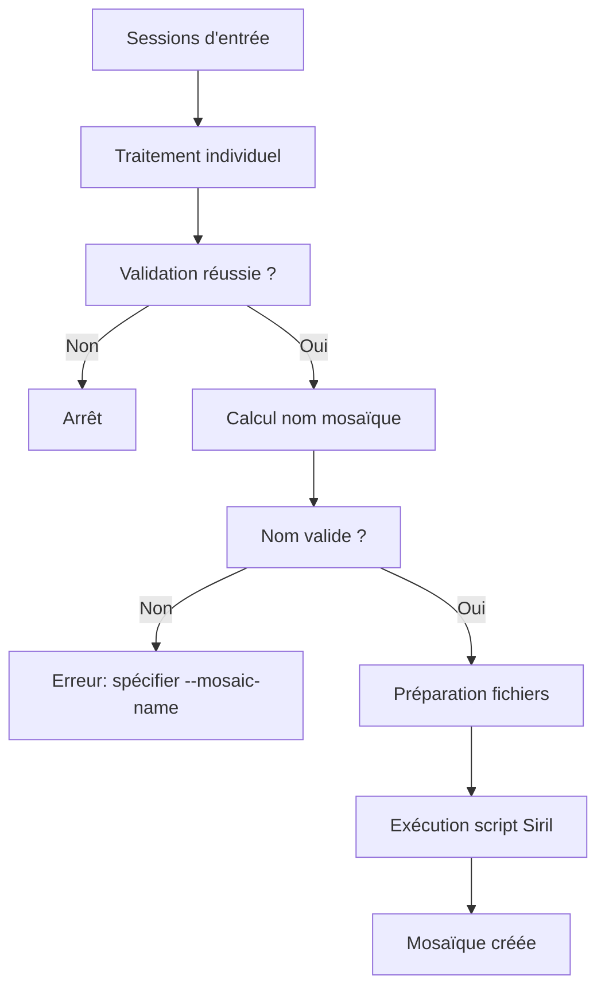

# Guide d'utilisation de la fonctionnalité Mosaïque

## Vue d'ensemble

La fonctionnalité mosaïque permet d'assembler automatiquement plusieurs sessions de traitement light en une seule image mosaïque. Cette fonctionnalité est intégrée au script `lightProcess.py` avec un script Siril optimisé intégré directement.

## Utilisation de base

### 1. Traitement simple avec mosaïque

```bash
python3 bin/lightProcess.py session_M31_nord session_M31_sud --mosaic
```

Cette commande :
1. Traite chaque session individuellement
2. Calcule automatiquement le nom de base ("session_M31")
3. Assemble les résultats en mosaïque avec le script intégré

### 2. Nom personnalisé pour la mosaïque

```bash
python3 bin/lightProcess.py panel1 panel2 panel3 --mosaic --mosaic-name "M31_complete"
```

Utilisez `--mosaic-name` quand :
- Le nom automatique fait moins de 3 caractères
- Vous voulez un nom spécifique

## Script Siril intégré

Le script Siril est maintenant intégré directement dans le module, optimisé pour les mosaïques standards :

```siril
requires 1.2.0

# Conversion des fichiers d'entrée
convert panel -out=converted
cd converted

# Détection des étoiles pour l'alignement
seqfindstar panel -sigma=1.5 -roundness=0.6

# Alignement avec transformation homographique
register panel -transf=homography -2pass

# Empilement avec rejet statistique et normalisation
stack r_panel rej 3 3 -norm=addscale -output_norm=mul -out=mosaic_name

# Sauvegarde
save mosaic_name
```

### Avantages du script intégré :
- ✅ **Aucune configuration** : Fonctionne immédiatement
- ✅ **Optimisé** : Paramètres testés pour les mosaïques
- ✅ **Robuste** : Gestion des cas courants
- ✅ **Maintenable** : Modifications centralisées dans le code

## Calcul automatique du nom

Le système calcule automatiquement un nom de base en analysant les noms des répertoires :

| Répertoires d'entrée | Nom calculé | Valide ? |
|----------------------|-------------|----------|
| `session_M31_nord`, `session_M31_sud` | `session_M31` | ✅ Oui |
| `NGC7000_panel1`, `NGC7000_panel2` | `NGC7000` | ✅ Oui |
| `A`, `B` | `""` | ❌ Trop court |
| `different`, `names` | `""` | ❌ Pas de préfixe commun |

## Prérequis

### Structure des fichiers

Après traitement, chaque session doit avoir produit un fichier stacked :
```
output_dir/
├── session_M31_nord/
│   └── session_M31_nord_stacked.fit  # Fichier recherché
├── session_M31_sud/
│   └── session_M31_sud_stacked.fit
└── M31_mosaic.fit  # Résultat final
```

## Flux de travail



## Options avancées

### Arguments simplifiés

```bash
python3 bin/lightProcess.py \
    session_M31_nord session_M31_sud session_M31_est \
    --mosaic \
    --mosaic-name "M31_triptyque" \
    --output /path/to/results \
    --work-dir /tmp/mosaic_work \
    --log-level INFO
```

### Mode simulation

```bash
python3 bin/lightProcess.py session1 session2 --mosaic --dry-run
```

Le mode `--dry-run` :
- Traite les sessions en simulation
- Valide la configuration mosaïque
- N'exécute pas le script Siril

## Résolution de problèmes

### Erreur : "Nom automatique trop court"

```
Erreur: Le nom automatique 'A' est trop court (< 3 caractères)
```

**Solution** : Spécifiez un nom explicite :
```bash
--mosaic-name "MonNomPersonnalise"
```

### Erreur : "Fichier light traité introuvable"

```
Aucun fichier light traité trouvé pour la session sessionX
```

**Causes possibles** :
- Le traitement de la session a échoué
- Le fichier de sortie n'est pas au bon endroit
- Nom de fichier non standard

**Solution** : Vérifiez que chaque session a bien produit son fichier stacked.

## Exemples complets

### Exemple 1 : Mosaïque M31

```bash
# Structure des répertoires
tree sessions/
# sessions/
# ├── M31_nord/light/  (250 images)
# ├── M31_sud/light/   (180 images)
# └── M31_est/light/   (200 images)

# Traitement avec mosaïque
python3 bin/lightProcess.py \
    sessions/M31_nord sessions/M31_sud sessions/M31_est \
    --mosaic \
    --mosaic-name "M31_complete" \
    --output results/ \
    --log-level INFO

# Résultat : results/M31_complete_mosaic.fit
```

### Exemple 2 : Panels NGC7000

```bash
python3 bin/lightProcess.py \
    NGC7000_panel1 NGC7000_panel2 NGC7000_panel3 NGC7000_panel4 \
    --mosaic
    
# Le nom sera automatiquement "NGC7000"
```

## Modification du script intégré

Pour personnaliser le script Siril, modifiez la méthode `_generate_mosaic_script()` dans `lib/mosaic.py` :

```python
def _generate_mosaic_script(self, input_files: List[Path]) -> str:
    """Génère le script Siril personnalisé."""
    script_content = f"""requires 1.2.0
# Votre script personnalisé ici
cd "{self.mosaic_input_dir}"

# Ajoutez vos commandes Siril spécifiques
convert panel -out=converted
cd converted

# Paramètres personnalisés pour votre usage
seqfindstar panel -sigma=2.0 -roundness=0.8  # Plus strict
register panel -transf=similarity  # Transformation simplifiée
stack r_panel median -norm=mul -out={self.mosaic_name}_mosaic  # Médian

save {self.mosaic_name}_mosaic
close"""
    return script_content
```

## Intégration dans le workflow

La mosaïque s'intègre naturellement dans le workflow existant :

1. **Traitement normal** : Chaque session est traitée indépendamment
2. **Assemblage automatique** : Les résultats sont assemblés si `--mosaic` est spécifié
3. **Nettoyage** : Les fichiers temporaires sont automatiquement supprimés

Cela permet d'avoir à la fois les résultats individuels ET la mosaïque finale.