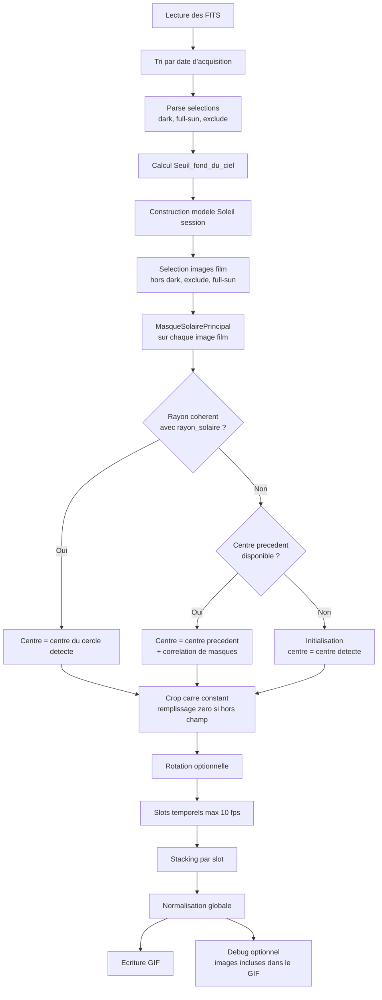

# solarEclipseGif.py

Documentation et specification de maintenance de `bin/solarEclipseGif.py`.

Ce document est maintenant la source de verite fonctionnelle du script. Les
nouveaux elements de specification doivent etre ajoutes ici avant ou pendant les
evolutions du code.

## Specification Fonctionnelle

### Parametres

Les parametres sont :

- `--input-dir` : repertoire des images sources.
- `--dark-calib-frames` : liste d'index d'images.
- `--manual-seuil-fond-du-ciel` : nombre.
- `--full-sun-frames` : liste d'index d'images.
- `--first-nearly-full-sun-frames` : parametre par defaut `10`.
- `--exclude-frames`.
- `--debug-dir` : repertoire des images de debug. Par defaut, sous-repertoire
  de `--input-dir` nomme `debug`.
- `--debug-full-sun`.
- `--debug-shifts` : cree et alimente le repertoire de debug du calcul des
  decalages.
- `--debug-gif-frames` : cree et alimente un repertoire contenant les images
  effectivement incluses dans le GIF final.
- `--debug-watershed` : calcule et affiche le watershed dans les images de
  debug de `MasqueSolairePrincipal`. Par defaut, le watershed n'est pas calcule.
- `--rotate-clockwise-deg`.
- `--target-duration`.
- `--output`.
- `--log-level` : niveau de log technique.

Les selections d'images sont 1-based et acceptent les plages :

```text
1-10,15,20-25
```

### Objectif

Faire un film qui dure `--target-duration` a partir des images transmises.

Les images sont toutes des FITS en noir et blanc.

Dans la mesure du possible, les traitements doivent prendre avantage de la
disponibilite d'un GPU, ici NVIDIA/CUDA, pour accelerer les calculs. Les
operations de correlation sont prioritaires pour cette acceleration. Si le GPU
ou la pile CUDA n'est pas disponible, le traitement doit continuer en CPU sans
changer les options utilisateur.

### Processus Global

#### 0. Liste Des Frames

Faire la liste ordonnee des frames et enlever les `--exclude-frames`.

#### 0bis. Nettoyage Des Sorties De Debug

Avant de lancer les traitements, le programme principal supprime les sorties de
debug correspondant aux options activees, afin d'eviter toute confusion avec une
execution precedente.

Le nettoyage est limite aux sorties connues du script :

- `<debug-dir>/full_sun_frames/` et `<debug-dir>/full_sun_model.png` si
  `--debug-full-sun` est actif ;
- `<debug-dir>/shifts/` si `--debug-shifts` est actif ;
- `<debug-dir>/gif_frames/` si `--debug-gif-frames` est actif.

Le repertoire `--debug-dir` lui-meme n'est pas supprime.

#### 1. Obtenir Les Seuils Et Informations Sur Le Soleil

##### 1.1. Obtenir Le Niveau Du Fond Du Ciel

`Seuil_fond_du_ciel` est le niveau en dessous duquel ce n'est pas un affichage
de Soleil.

Regles :

1. Si l'utilisateur a defini ce niveau par parametre
   `--manual-seuil-fond-du-ciel`, il est pris en compte.
2. Sinon, si l'utilisateur a donne une liste d'images dark
   `--dark-calib-frames`, il est calcule en prenant le niveau moyen du 99e
   percentile des images correspondantes.
3. Sinon, il vaut `0`.

##### 1.1bis. Methode Commune De Masque Solaire Principal

La detection du centre du Soleil plein et la detection du Soleil masque doivent
utiliser la meme methode de base, nommee :

```text
MasqueSolairePrincipal
```

Cette methode prend en parametres :

- `image` : image FITS monochrome a analyser ;
- `Seuil_fond_du_ciel` : seuil minimal du fond du ciel ;
- `chemin_debug` : chemin de l'image de debug a produire. Si ce parametre vaut
  `null`, aucune image de debug n'est produite ;
- `info_debug` : texte optionnel affiche dans l'image de debug, notamment les
  informations d'acquisition issues du FITS d'origine ;
- `sigma_lissage` : intensite du lissage gaussien leger ;
- `facteur_seuil` : facteur applique au seuil permissif calcule, par exemple a
  partir d'Otsu ;
- `fraction_rayon_fermeture` : taille relative de l'element structurant de
  fermeture morphologique ;
- `surface_min_composante` : surface minimale acceptee pour supprimer les petits
  objets parasites ;
- `remplir_trous` : booleen indiquant si les trous de la composante principale
  doivent etre remplis.
- `calculer_watershed` : booleen indiquant si une segmentation watershed de
  l'image d'entree doit etre calculee pour preparer un futur ajustement du
  contour solaire. Sa valeur par defaut est `false`.
- `methode_cercle` : methode robuste d'ajustement du cercle solaire. La methode
  de reference est `RANSAC` appliquee aux candidats du limbe externe.

La sequence de traitement est :

1. leger lissage, par exemple gaussien ;
2. seuillage assez permissif, eventuellement Otsu ;
3. fermeture morphologique pour combler taches, petits trous et defauts ;
4. conservation de la plus grande composante connexe ;
5. remplissage des trous si `remplir_trous` est actif ;
6. calcul du centre geometrique du masque ;
7. determination des candidats du limbe solaire externe puis ajustement robuste
   du cercle par `RANSAC` ;
8. si `calculer_watershed=true`, calcul d'un watershed de l'image d'entree,
   amorce par le masque solaire principal, pour produire un candidat
   d'ajustement au contour du Soleil ;
9. si `chemin_debug` n'est pas `null`, creation du repertoire parent si
   necessaire puis ecriture de l'image de debug dans ce chemin.

Le watershed est optionnel. Il n'est calcule que si `calculer_watershed=true`,
par exemple via l'option CLI `--debug-watershed` conjointement a une option de
debug produisant des images `MasqueSolairePrincipal`. Meme lorsqu'il est
calcule, il ne remplace pas le masque solaire principal dans les traitements.

Pour un Soleil partiellement masque, le cercle ne doit pas etre ajuste sur tout
le contour du croissant visible, car le bord lunaire fausserait le resultat. La
methode privilegie donc les points de contour appartenant au bord de l'enveloppe
convexe du masque visible, ce qui favorise le limbe solaire externe. `RANSAC`
ajuste ensuite le cercle en rejetant les points incoherents. Si l'ajustement
RANSAC echoue, le script revient a un ajustement par moindres carres sur les
points disponibles.

L'indice de confiance RANSAC est defini comme :

```text
confiance_ransac = nombre_points_inliers / nombre_points_candidats
```

Cet indice n'est pas une probabilite absolue, mais une mesure d'accord entre les
points candidats du limbe externe et le cercle robuste trouve par RANSAC.

La methode renvoie :

- le masque de seuillage simple, utile pour le debug ;
- le masque solaire principal nettoye, utilise pour les mesures et correlations ;
- le centre calcule ;
- le rayon/cercle calcule ;
- le cercle robuste RANSAC, s'il est valide ;
- le cercle par moindres carres ;
- l'indice de confiance RANSAC, ainsi que le nombre d'inliers et de candidats ;
- le masque watershed candidat et ses frontieres, utiles pour l'analyse debug et
  un futur ajustement de contour, seulement si le calcul watershed est active.

Format de debug standard de `MasqueSolairePrincipal` :

Quand `chemin_debug` est fourni, la methode produit une image unique contenant
quatre panneaux organises en grille 2 x 2 :

1. en haut a gauche : image source avec le contour interne du masque de
   seuillage simple ;
2. en haut a droite : image source avec le contour interne du masque solaire
   principal ;
3. en bas a gauche : image source avec le contour interne du masque watershed si
   le calcul est actif ; sinon ce panneau indique que le watershed n'a pas ete
   calcule ;
4. en bas a droite : image source avec les deux cercles calcules en
   surimpression :
   cercle RANSAC en bleu et cercle moindres carres en orange. La legende affiche
   aussi l'indice de confiance RANSAC et le nombre d'inliers/candidats.

Les trois premiers panneaux ne montrent que les contours internes, jamais le
remplissage des masques, afin de faciliter l'audit visuel des frontieres.

Quand `info_debug` est fourni, il est affiche en gros caracteres dans le panneau
haut gauche de l'image de debug. Pour une image FITS brute, ce texte doit
contenir au minimum l'index de frame, la duree d'exposition et le gain
disponibles dans l'en-tete FITS. Si une valeur est absente, elle est affichee
comme indisponible. Les legendes et informations textuelles doivent rester assez
grandes pour etre lisibles sans zoom important.

##### 1.2. Construire Un Modele De Soleil De La Session

###### 1.2.1. Selection Des Images De Modele

On prendra les images de Soleil plein `--full-sun-frames`, sinon les
`--first-nearly-full-sun-frames` premieres images.

###### 1.2.2. Calcul Du Centre Du Soleil

Pour chaque image selectionnee, appeler `MasqueSolairePrincipal` avec
`remplir_trous=true`.

L'etape conserve, pour chaque image selectionnee, les resultats suivants de
`MasqueSolairePrincipal` :

- le centre calcule du Soleil ;
- le rayon/cercle calcule, en pratique le cercle RANSAC si valide, sinon le
  cercle de repli ;
- le masque solaire principal nettoye ;
- les informations de confiance RANSAC, utiles au debug et a l'audit ;
- l'association avec l'image source, afin de recadrer puis stacker les images du
  modele de session.

Valeur de `chemin_debug` transmise a `MasqueSolairePrincipal` :

- si `--debug-full-sun` est actif :
  `<debug-dir>/full_sun_frames/full_sun_XXXX_<nom_image>.png` ;
- sinon : `null`.

###### 1.2.3. Modele Image

Recadrer et stacker les images pour obtenir un modele d'image du Soleil de la
session.

###### 1.2.4. Calcul Du Rayon Solaire

Calculer `rayon_solaire` a partir de l'image modele :

1. appeler `MasqueSolairePrincipal` sur l'image modele avec
   `remplir_trous=true` et `chemin_debug=null` ;
2. calculer `rayon_solaire` par moyenne des rayons obtenus sur les images, et
   calcul de la dimension necessaire des images a produire :

```text
taille_cote_image = 2.5 * rayon_solaire
```

Si l'option `--full-sun-frames` est positionnee, stocker dans le repertoire de
debug une image ayant cote a cote :

1. l'image resultant du stacking ;
2. le masque calcule ;
3. l'image resultante avec le cercle de detection dans une autre couleur ainsi
   que son centre.

Cette image de debug du modele empile affiche aussi les informations
d'acquisition moyennes des images sources utilisees pour le stacking :
exposition moyenne, gain moyen, et nombre de valeurs effectivement disponibles.

##### 1.3. Generation Du Film

Generation du film a partir de toutes les images sauf :

- les images `--dark-calib-frames` ;
- les images `--exclude-frames` ;
- les images `--full-sun-frames`.

###### 1.3.1. Ordre Des Images

Ordonner les images a partir de l'information date de prise de vue presente dans
le FITS.

###### 1.3.2. Detection Du Centre Et Crop

Les anciennes etapes separees `Calcul Des Decalages` et `Centrage Et Crop` sont
remplacees par une etape unique appliquee a chaque image du film.

Pour chaque image :

1. Appeler `MasqueSolairePrincipal` avec `remplir_trous=true`.
   Si `--debug-shifts` est actif, `chemin_debug` pointe vers
   `<debug-dir>/shifts`. Sinon, `chemin_debug=null`.
   Quand l'image analysee est une image FITS brute, l'etape transmet aussi a
   `MasqueSolairePrincipal` les informations d'acquisition disponibles dans
   l'en-tete FITS : duree d'exposition et gain.
2. Comparer le rayon du cercle obtenu au `rayon_solaire` obtenu a l'etape
   `Calcul Du Rayon Solaire`.
3. Si le rayon du cercle obtenu est coherent avec `rayon_solaire` :
   centrer directement le crop sur le centre du cercle trouve.
4. Sinon, calculer le centre de decoupage de l'image courante a partir du centre
   de decoupage precedent et du decalage relatif mesure par correlation entre le
   masque precedent et le masque courant.
5. Decouper l'image selon un carre centre sur le centre retenu, de cote
   `taille_cote_image`.
6. Si le decoupage sort de l'image a decouper, remplir avec des zeros.

La premiere image du film initialise le centre precedent avec le centre renvoye
par `MasqueSolairePrincipal`, meme si son rayon n'est pas coherent avec
`rayon_solaire`. Ensuite, le centre de decoupage courant est toujours calcule :
soit directement par le cercle detecte, soit par propagation du centre precedent
avec le decalage relatif entre masques.

La coherence du rayon est definie par une tolerance relative autour de
`rayon_solaire`. L'implementation actuelle utilise une tolerance de 20 %.

Si un GPU NVIDIA/CUDA utilisable est disponible, les correlations relatives
entre masques doivent etre executees sur GPU pour accelerer cette etape. Sinon,
le calcul CPU reste le chemin de repli.

Quand `--debug-shifts` est actif, les images de debug produites sont les sorties
standard de `MasqueSolairePrincipal` pour chaque image analysee. Les valeurs de
centre retenu, rayon mesure, rayon de reference et methode utilisee sont
journalisees dans les logs.

##### 1.4. Nombre D'Images GIF

Calculer le nombre d'images `nombre_gif` a produire en partant sur un maximum de
10 fps pour le GIF terminal, et calculer `duree_creneau_gif` sur la duree
specifiee par l'utilisateur.

##### 1.5. Groupement, Durees Et Production Du GIF

1. La duree d'acquisition totale, difference entre la derniere image acquise et
   la premiere, doit etre divisee en `nombre_gif` slots.
2. Chaque image acquise doit etre associee a un slot temporel.
3. Si un slot n'est pas associe a une image, il doit etre supprime et la duree
   du slot precedent allongee de la duree du slot courant.
4. Pour les slots associes a plusieurs images, proceder a un stacking des
   images.
5. Les informations d'acquisition associees aux images stackees doivent etre
   propagees avec moyenne des valeurs connues de duree d'exposition et de gain.
   Si des sorties de debug utilisent une image empilee, elles doivent afficher
   ces valeurs moyennes et le nombre d'images ayant fourni la valeur.
6. Pour chaque image finale incluse dans le GIF, journaliser dans les logs :
   l'index de l'image GIF, le numero de la premiere frame source utilisee, le
   nombre de frames source stackees, la duree du frame GIF, la liste des frames
   sources, la liste des durees d'exposition et la liste des gains.
7. A partir des durees et des images stackees, produire le GIF.
8. Si `--debug-gif-frames` est actif, ecrire dans `<debug-dir>/gif_frames/`
   chaque image effectivement incluse dans le GIF apres normalisation globale et
   conversion, dans l'ordre d'apparition du GIF. Le nom du fichier doit contenir
   l'index de l'image GIF, la duree du frame, les indices des images sources, et
   les valeurs moyennes connues d'exposition et de gain.

## Workflow Global



## Commandes

Traitement avec images plein Soleil explicites :

```bash
bin/solarEclipseGif.sh \
  --input-dir ~/Images/AstroDirect/sun/Light \
  --full-sun-frames 1-10 \
  --dark-calib-frames 180-190 \
  --target-duration 30 \
  --output ~/Images/AstroDirect/sun/eclipse.gif
```

Traitement sans images plein Soleil explicites :

```bash
bin/solarEclipseGif.sh \
  --input-dir ~/Images/AstroDirect/sun/Light \
  --first-nearly-full-sun-frames 10 \
  --target-duration 30 \
  --output ~/Images/AstroDirect/sun/eclipse.gif
```

Debug du modele plein Soleil :

```bash
bin/solarEclipseGif.sh \
  --input-dir ~/Images/AstroDirect/sun/Light \
  --full-sun-frames 1-10 \
  --debug-full-sun \
  --output ~/Images/AstroDirect/sun/eclipse.gif
```

## Fichiers Generes

- `--output` : GIF final.
- `<debug-dir>/full_sun_frames/*.png` : debug par image de calibration plein
  Soleil, seulement avec `--debug-full-sun`.
- `<debug-dir>/full_sun_model.png` : debug du modele empile, seulement avec
  `--debug-full-sun`.
- `<debug-dir>/shifts/*.png` : debug du calcul des decalages, seulement avec
  `--debug-shifts`.
- `<debug-dir>/gif_frames/*.png` : images effectivement incluses dans le GIF,
  seulement avec `--debug-gif-frames`.

## Acceleration GPU

Le script detecte automatiquement la disponibilite de CuPy et d'un GPU CUDA.

Quand le GPU est utilisable :

- la correlation relative entre une image sans rayon coherent et l'image
  precedente est calculee avec FFT sur GPU.

Quand CuPy, CUDA ou le GPU NVIDIA ne sont pas disponibles, le script utilise le
chemin CPU sans erreur pour l'utilisateur.

CuPy n'est pas force dans `requirements.txt`, car le paquet a installer depend
de la version CUDA disponible localement, par exemple `cupy-cuda12x` ou
`cupy-cuda11x`.

## Notes De Maintenance

Le script doit rester strictement aligne avec la section
`Specification Fonctionnelle` de ce document.

Si la specification evolue, mettre a jour ensemble :

- la section `Specification Fonctionnelle` ;
- `bin/solarEclipseGif.py` ;
- `bin/solarEclipseGif.sh` si les options CLI changent ;
- les exemples du `README.md`.

Ne pas reintroduire de branches experimentales non demandees dans la
specification. Si une strategie alternative est necessaire, elle doit d'abord
etre ajoutee dans ce document.
