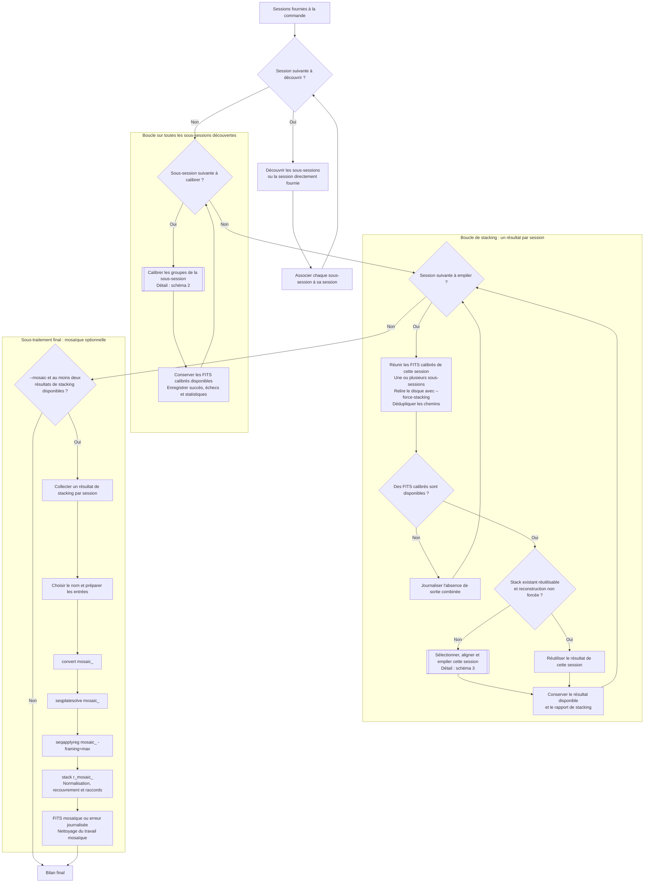
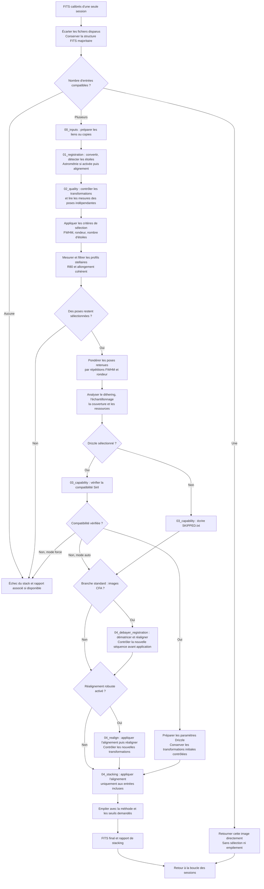

# lightProcess — parcours de traitement

[Documentation](../../../README.md) › [lightProcess](../README.md)

Le parcours comporte une boucle de calibration sur les sous-sessions, une
boucle de stacking sur les sessions d’entrée, puis une mosaïque optionnelle.
Chaque calibration comporte elle-même une boucle sur les groupes de lights
et un sous-traitement des flats. Les schémas ci-dessous détaillent ces niveaux.

## Vocabulaire et périmètre du stacking

Une **session** est un répertoire fourni en paramètre à la commande.
Ses **sous-sessions** sont les répertoires d’acquisition contenant `light/`
ou `Light/`, avec éventuellement `flat/` ou `Flat/`, immédiatement en dessous.
Si la session contient directement `light/`, elle est traitée comme une unique
sous-session. Un **groupe de calibration** réunit des lights compatibles par
leurs métadonnées au sein d’une sous-session.

Les FITS calibrés de toutes les sous-sessions d’une session sont réunis pour
produire un seul résultat de stacking. Ce traitement est identique avec une
ou plusieurs sous-sessions. Avec `--mosaic`, les résultats de stacking des
sessions sont ensuite assemblés ; les poses calibrées ne sont pas ajoutées
aux entrées de la mosaïque.

## 1. Boucles principales et mosaïque finale

Le script découvre d’abord les sous-sessions de toutes les sessions, puis traite
leur liste. La boucle de stacking parcourt ensuite à nouveau les sessions.
Le mode simulation journalise les traitements prévus sans lancer Siril ; le
schéma montre le parcours d’exécution effectif.

La mosaïque nécessite au moins deux sessions fournies et deux résultats de
stacking disponibles. Voir [la mosaïque](../MOSAIC.md) pour ses traitements.

## 2. Sous-traitement d’une sous-session : groupes, flats et lights

Les groupes sont indépendants : l’échec d’un groupe est journalisé puis la
boucle poursuit avec le suivant. Les flats de la sous-session sont chargés
et filtrés pour chaque groupe de lights concerné. Le code conserve la durée
majoritaire des flats compatibles ; il ne produit pas un master pour chaque
durée de flat présente.

```mermaid
flowchart TD
    SESSION["Entrée : une sous-session"] --> LIGHTS["Lister les lights et lire leurs métadonnées"]
    LIGHTS --> GROUPS["Écarter les fichiers invalides<br/>Grouper caméra, température, exposition, gain et binning"]
    GROUPS --> NEXT{"Groupe de lights suivant ?"}
    NEXT -->|Non| SUMMARY["Résumé de la sous-session<br/>Retour des FITS calibrés produits ou réutilisés"]

    subgraph GROUP_LOOP["Boucle sur les groupes de calibration"]
        NEXT -->|Oui| DARK_MODE{"Darks activés ?"}
        DARK_MODE -->|Oui| DARK_LIGHT["Chercher le master dark adapté aux lights"]
        DARK_LIGHT --> DARK_FOUND{"Master dark trouvé ?"}
        DARK_FOUND -->|Non| FAILURE["Échec du groupe : journaliser la cause"]
        DARK_FOUND -->|Oui| FLAT_SELECTION
        DARK_MODE -->|Non| FLAT_SELECTION["Sélectionner les flats compatibles<br/>Caméra, gain et binning<br/>Garder la durée de pose majoritaire"]
        FLAT_SELECTION --> CALIBRATED_CACHE{"Calibrations exportées réutilisables<br/>sans --force et avec CFA adapté ?"}
        CALIBRATED_CACHE -->|Oui| REUSE_GROUP["Réutiliser les calibrations et leur séquence"]
        REUSE_GROUP --> NEXT
        CALIBRATED_CACHE -->|Non| PREPARE_LIGHTS["Préparer la séquence de lights"]
        PREPARE_LIGHTS --> HAS_FLATS{"Flats compatibles disponibles ?"}

        subgraph FLAT_PROCESS["Sous-traitement : master flat du groupe"]
            HAS_FLATS -->|Oui| FLAT_CACHE{"Master flat existant<br/>et calcul non forcé ?"}
            FLAT_CACHE -->|Oui| USE_FLAT["Utiliser le master flat"]
            FLAT_CACHE -->|Non| FLAT_DARK_MODE{"Darks activés ?"}
            FLAT_DARK_MODE -->|Oui| FIND_FLAT_DARK["Chercher le master dark adapté aux flats"]
            FIND_FLAT_DARK --> FLAT_DARK_FOUND{"Dark des flats trouvé ?"}
            FLAT_DARK_FOUND -->|Non| FAILURE
            FLAT_DARK_FOUND -->|Oui| PREPARE_FLATS["Préparer les flats et convertir dans flat_process"]
            FLAT_DARK_MODE -->|Non| PREPARE_FLATS
            PREPARE_FLATS --> CALIBRATE_FLATS["Calibrer les flats avec leur dark si activé<br/>Sinon conserver la séquence convertie"]
            CALIBRATE_FLATS --> STACK_FLATS["Empiler les flats en médiane<br/>avec normalisation multiplicative"]
            STACK_FLATS --> FLAT_OK{"Siril réussi et master flat présent ?"}
            FLAT_OK -->|Non| FAILURE
            FLAT_OK -->|Oui| USE_FLAT
        end

        HAS_FLATS -->|Non| CONVERT_LIGHTS["Nettoyer process et convertir les lights"]
        USE_FLAT --> CONVERT_LIGHTS
        CONVERT_LIGHTS --> CALIBRATE_LIGHTS["Calibrer les lights avec les masters disponibles<br/>Conserver le CFA en Drizzle auto ou force<br/>Dématricer en mode off"]
        CALIBRATE_LIGHTS --> LIGHT_OK{"Siril réussi et sorties calibrées présentes ?"}
        LIGHT_OK -->|Non| FAILURE
        LIGHT_OK -->|Oui| EXPORT["Copier les pp_light_*.fit(s)<br/>Exporter la séquence Siril associée"]
        EXPORT --> CLEANUP["Nettoyer les séquences temporaires<br/>sauf --keep-intermediate"]
        FAILURE --> CLEANUP
        CLEANUP --> NEXT
    end
```

Les échecs de préparation ou de lecture rejoignent aussi la sortie d’échec du
groupe. Le nettoyage concerne les séquences temporaires effectivement préparées.
Les règles de choix des masters figurent dans [Calibration](CALIBRATION.md).

## 3. Sous-traitement de stacking d’une session

Ce sous-traitement est appelé pour chaque session dans la boucle de
stacking. Les contrôles de qualité précèdent les pondérations. Les contrôles
supplémentaires après dématriçage ou réalignement vérifient les transformations,
sans recalculer les seuils FWHM, rondeur, comptage ou profils stellaires.

Les échecs Siril, les séquences illisibles et l’absence de transformation
admissible interrompent le sous-traitement. Le cas d’une seule image renvoie
son chemin sans produire les rapports des étapes non exécutées. Le détail des
commandes et du cadrage est donné dans [Alignement et empilement](STACKING.md).

## Pages de référence

| Étape | Détail |
|---|---|
| Entrées et calibration | [Découverte, groupement, darks, flats et CFA](CALIBRATION.md) |
| Choix des poses | [Sélection des images](../filter/stacking/IMAGE_SELECTION.md) |
| Contrôle des pixels | [Profils stellaires R80 et allongement](../filter/stacking/STELLAR_PROFILE_FILTER.md) |
| Alignement et stacking | [Scripts exécutés et branche standard/Drizzle](STACKING.md) |
| Décision Drizzle | [Conditions, ressources et paramètres](../filter/stacking/DRIZZLE_SPECIFICATION.md) |
| Sorties et relance | [Fichiers, cache, journaux et options de reprise](OUTPUTS.md) |
| Assemblage de champs | [Mosaïque optionnelle](../MOSAIC.md) |
| Séquences | [Images, mesures, transformations et écritures](../reference/SIRIL_SEQUENCE.md) |
