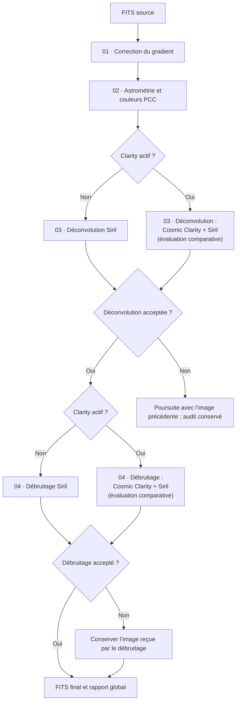

# postProcess — post-traitement d’une image FITS

[Documentation](../../README.md) › [Scripts](../README.md) › postProcess

`bin/postProcess.py` traite une image FITS à travers quatre étapes ordonnées :
**correction du gradient → étalonnage photométrique → déconvolution → débruitage**.
Chaque étape reçoit l’image retenue par la précédente et produit un rapport JSON.
Les quatre traitements sont activés par défaut ; leur activation peut être
modifiée par la ligne de commande ou par la configuration mémorisée.

Cette commande s’utilise séparément sur un résultat de stacking ou une mosaïque,
par exemple après [lightProcess](../lightProcess/README.md). Elle ne réalise ni
la calibration des poses brutes, ni leur empilement, ni un étirement final de
l’histogramme.

## Lancer un traitement

Depuis la racine du projet :

```bash
bin/postProcess.sh image_RGB.fit rapports/ \
  --photometry-object M20
```

Le premier argument est le FITS d’entrée. Le second, facultatif, choisit le
**répertoire de sortie** (un ancien chemin de rapport JSON reste accepté et son
dossier parent est utilisé). Sans cet argument, les sorties sont écrites à côté
du fichier source.

Chaque exécution crée un nom de base `<image>_postprocess_<backend>` :

- dossier d’étapes et d’artefacts intermédiaires :
  `<image>_postprocess_<backend>/`
- rapport global : `<image>_postprocess_<backend>.json`
- FITS final : `<image>_postprocess_<backend>.fits`

Le rapport global et le FITS final sont donc au même niveau que le dossier
d’étapes et partagent son nom de base.

Le wrapper conserve le dossier de lancement pour résoudre les chemins relatifs.
L’appel Python équivalent, avec le venv déjà activé, est :

```bash
python bin/postProcess.py image_RGB.fit rapports/
bin/postProcess.sh --help
```

Les étapes utilisant Siril génèrent des scripts exigeant **Siril 1.4 au minimum**.
L’entrée de la séquence complète doit être une image **RGB linéaire déjà
dématricée**, nécessaire à la photométrie. Le débruitage et la déconvolution
acceptent aussi les images monochromes, mais refusent une image CFA encore
identifiée par `BAYERPAT`. Pour une image monochrome, désactiver la photométrie.
La recherche d’objet au CDS et les catalogues distants nécessitent un accès réseau.
Voir [l’installation](../../INSTALLATION.md) pour l’environnement du projet.

## Ordre et circulation des images



Le schéma suppose les quatre étapes actives. Une étape désactivée est sautée et
l’image courante est transmise à la suivante. Une erreur d’exécution interrompt
la séquence, sauf le cas `no_safe_improvement` de la déconvolution : l’audit est
conservé et l’image d’entrée de l’étape est transmise à la suivante. Le refus
d’un candidat de débruitage pour qualité insuffisante est un résultat normal :
la séquence poursuit avec l’image précédente.

| Position | Traitement | Classe | Effet sur l’image |
|---|---|---|---|
| 01 | `gradient` | `GradientExtractor` | Soustrait les variations du fond |
| 02 | `photometry` | `PhotometricColorCalibrator` | Résout l’astrométrie et étalonne les couleurs |
| 03 | `deconvolution` | `DeconvolutionProcessor` (Siril seul) ou `CosmicClaritySharpenProcessor` (comparatif) | Améliore la finesse avec contrôle des étoiles et des artefacts |
| 04 | `denoise` | `NoiseReductionProcessor` (Siril seul) ou `CosmicClarityDenoiseProcessor` (comparatif) | Réduit le bruit si les contrôles de qualité sont satisfaits |

Les indices restent fixes lorsqu’une étape est désactivée. Les options
`--enable-gradient`, `--enable-photometry`, `--enable-denoise` et
`--enable-deconvolution` activent explicitement les étapes correspondantes ; les
options `--disable-…` les désactivent. Les variantes `--enable_<préfixe>` et
`--disable_<préfixe>` sont également acceptées. Le CLI ne change pas leur ordre.

## Moteur Cosmic Clarity optionnel

Le mode comparatif Cosmic Clarity + Siril est activé par défaut.
Chaque étape `deconvolution` et `denoise` évalue **les deux moteurs** (Cosmic
Clarity et Siril) et conserve automatiquement la meilleure sortie acceptée.
Si aucune déconvolution n’est acceptée, le statut reste
`no_safe_improvement` et l’image reçue est conservée. Si aucun débruitage n’est
accepté, l’image reçue est également conservée.

Algorithme appliqué en mode comparatif :

1. exécution des deux moteurs ;
2. contrôles de qualité sur chaque candidat (mêmes métriques stellaires) ;
3. conservation des seuls candidats `accepted` ;
4. calcul d’un score interne par candidat (netteté ou débruitage) ;
5. sélection du score maximal, sinon conservation de l’image d’entrée.

```bash
bin/postProcess.sh --install-cosmic-clarity
bin/postProcess.sh image_RGB.fit --enable-clarity
bin/postProcess.sh image_RGB.fit --disable-clarity
```

L'option d'installation est capturée par le `.sh` ; elle utilise pip système
pour installer les dépendances dans le venv et récupérer les poids vérifiés.
`--enable-clarity` et `--disable-clarity` appartiennent au programme Python et
peuvent être mémorisées avec `-S`.
Les noms des rapports, l'ordre et les contrôles d'acceptation restent les mêmes.
Les algorithmes détaillés ci-dessous décrivent le moteur Siril.
Quand Clarity est actif, les sections 03/04 sont exécutées en double
(Cosmic Clarity + Siril), puis une sélection automatique conserve le meilleur
candidat accepté.
Voir [Cosmic Clarity](cosmic-clarity.md) pour les classes, modèles, paramètres,
ressources, différences avec l'amont et limites de validation.

## 01 — Correction du gradient

Le gradient est une variation lente du fond de ciel. Le traitement estime ce
fond puis soustrait ses variations **en conservant son niveau au centre de
l’image**. Il travaille séparément sur chaque canal, produit un FITS flottant
et conserve les métadonnées WCS et les extensions FITS.

Deux méthodes sont disponibles :

- **RBF**, par défaut : mesure des médianes locales sur une grille, rejet des
  cellules trop brillantes, puis interpolation avec SciPy. Le lissage règle
  la régularisation du modèle de fond.
- **Polynomiale** : analyse plusieurs degrés pour en recommander un, puis ajuste
  ce degré séparément sur chaque canal avec rejet des valeurs aberrantes.

Le PNG facultatif des points de mesure permet d’inspecter l’échantillonnage du
fond. Les grandes nébulosités peuvent influencer l’estimation : comparer le
résultat au FITS d’entrée avant de retenir le réglage.

| Option | Défaut local | Rôle |
|---|---|---|
| `--gradient-method` | `rbf` | `rbf` ou `polynomial` |
| `--gradient-smoothing` | `0.5` | Lissage RBF, de 0 à 1 |
| `--gradient-samples-per-line` | `20` | Densité de la grille RBF |
| `--gradient-grid-tolerance` | `2.0` | Seuil de rejet des cellules brillantes, en sigma robuste |
| `--gradient-keep-all-samples` | désactivé | Conserver aussi les cellules brillantes ; inverse : `--no-gradient-keep-all-samples` |
| `--gradient-min-order` / `--gradient-max-order` | `1` / `3` | Degrés testés en mode polynomial, entre 1 et 5 |
| `--gradient-sample-fraction` | `0.3` | Fraction des pixels ajustés en mode polynomial |
| `--gradient-max-samples` | `10000` | Nombre maximal de pixels ajustés en mode polynomial |
| `--gradient-points` | `100` | Nombre de points affichés pour l’analyse polynomiale |
| `--gradient-measurement-image` | activé | PNG de contrôle ; désactiver avec `--no-gradient-measurement-image` |
| `--gradient-output` | dossier du rapport individuel | Répertoire du FITS corrigé et des aperçus |

Pour ne lancer que cette étape :

```bash
bin/postProcess.sh image.fit rapports/gradient.json \
  --enable-gradient --disable-photometry --disable-denoise --disable-deconvolution \
  --gradient-method polynomial --gradient-max-order 2
```

Ce traitement utilise Python et ne lance pas Siril.

## 02 — Astrométrie et étalonnage photométrique

Sur une image RGB linéaire, le traitement appelle successivement `platesolve`
puis `pcc` dans Siril. L’astrométrie associe les pixels à des coordonnées célestes ;
PCC utilise les étoiles d’un catalogue pour étalonner les couleurs.

Le centre du champ peut être donné par un nom d’objet recherché au CDS ou par
ses coordonnées ICRS/J2000 en degrés. Ces deux options sont exclusives. Sans
centre explicite, Siril utilise les informations disponibles dans l’image et
ses réglages. Un centre explicite ou `--photometry-force` demande une nouvelle
résolution ; sinon une solution WCS existante peut être réutilisée.

| Option | Rôle ; défaut local si non précisé |
|---|---|
| `--photometry-object NOM` | Recherche au CDS ; aucun objet par défaut |
| `--photometry-coordinates RA DEC` | Centre en degrés ; RA dans `[0, 360[`, DEC dans `[-90, 90]` |
| `--photometry-focal MM` | Focale ; sinon métadonnées/réglages Siril |
| `--photometry-pixelsize UM` | Taille effective du pixel ; tenir compte du binning et du rééchantillonnage |
| `--photometry-force` | Refaire la résolution, désactivé par défaut |
| `--photometry-noflip` | Conserver l’orientation pendant la résolution, désactivé par défaut |
| `--photometry-downscale` | Sous-échantillonner pour la résolution, désactivé par défaut |
| `--photometry-solve-catalog` | `tycho2`, `nomad`, `localgaia`, `gaia`, `ppmxl`, `brightstars` ou `apass` ; sinon choix Siril |
| `--photometry-catalog` | Catalogue PCC : `nomad`, `apass`, `localgaia` ou `gaia` ; sinon choix Siril |
| `--photometry-limitmag` | Magnitude limite positive pour PCC ; non imposée par défaut |
| `--photometry-output` | FITS étalonné ; par défaut `02_photometry.fits` dans le dossier des étapes |

Le résultat n’est publié qu’après réussite de Siril et vérification des dimensions
et de la présence d’un WCS céleste. Le rapport conserve les coordonnées utilisées,
les commandes, les chemins du script et du journal, ainsi que `output_image`.

## 03 — Déconvolution contrôlée

La déconvolution cherche à réduire l’étalement des détails. Elle utilise
Richardson–Lucy par descente de gradient avec régularisation TV, sur une copie
de l’image reçue. La PSF est le noyau représentant cet étalement.

Ce paragraphe décrit le traitement **Siril** (`--disable-clarity`) ; en mode
comparatif (par défaut), un candidat **Cosmic Clarity** est évalué en parallèle
et soumis aux mêmes contrôles d’acceptation.

Par défaut, la PSF est estimée par Siril avec `makepsf blind -l0`. L’option
`--deconvolution-psf-method stars` utilise une sélection d’étoiles fines, rondes
et isolées. Le premier essai emploie 10 itérations et un pas de `0.0003`.

L’acceptation repose sur les mêmes étoiles avant et après : au moins 10 paires et
70 % des étoiles valides retrouvées par défaut. Il faut un gain d’au moins 2 %
sur la FWHM moyenne et le ratio médian apparié, sans perte de rondeur moyenne
supérieure à `0.01`. Le bruit ne doit pas dépasser 1,15 fois son niveau initial,
et la fraction de nouveaux anneaux ne doit pas dépasser 10 %. Les contrôles
d’artefacts portent sur tous les canaux.

### Détail du candidat Cosmic Clarity (mode comparatif)

En mode comparatif, l’étape produit aussi un candidat neuronal :

- application du modèle stellaire puis des modèles non stellaires
  (interpolation sur le rayon `--cosmic-nonstellar-radius`) ;
- mélange entrée/prédiction selon `--cosmic-stellar-amount` et
  `--cosmic-nonstellar-amount` ;
- écriture d’un candidat FITS dédié, puis mesures Siril avant/après sur le même
  canal (`--deconvolution-layer`) et appariement stellaire identique.

Le candidat Siril et le candidat Cosmic Clarity sont ensuite comparés :

- seuls les candidats au statut `accepted` sont éligibles ;
- un score de netteté est calculé pour chaque candidat accepté :
  `2*mean_gain + 2*ratio_gain - 0.2*noise_penalty - 0.2*ring_penalty` ;
- le candidat au score maximal devient `03_deconvolution.fits` ;
- si aucun candidat n’est accepté, l’étape renvoie `no_safe_improvement` et
  conserve l’image d’entrée.

**Le repli adaptatif est activé par défaut.** Si le premier essai échoue, le
traitement extrait le tiers central de chaque dimension de l’original, construit
une PSF à partir d’étoiles ajustées par un profil Moffat, puis teste des pas
croissants de `0.0004` à `0.001` par défaut. Chaque essai repart du recadrage
original. La recherche s’arrête au premier échec des contrôles d’artefacts.
Le dernier pas accepté est appliqué au champ entier, qui doit à nouveau passer
les contrôles. Utiliser `--no-deconvolution-adaptive` pour forcer le mode simple.
Les essais sont numérotés dans le journal et dans `attempts[].number` du
rapport JSON. Une erreur locale de PSF (par exemple moins de trois étoiles
Moffat admissibles) est conservée dans l’audit et invalide ce repli seulement.
Une erreur d’exécution d’un essai laisse les pas suivants disponibles se
poursuivre ; un rejet pour artefacts arrête toujours la montée du pas.
En mode comparatif, le candidat Cosmic Clarity reste évalué et sélectionnable.
Pour les étapes de déconvolution et de débruitage, le journal `INFO` présente
les deux évaluations, leurs mesures et verdicts, les scores des candidats
acceptés puis le choix final. Voir le [détail du journal comparatif](cosmic-clarity.md#déroulé-comparatif-des-étapes-03-et-04).

Avant le démarrage de l’étape, le dossier `03_deconvolution_work/` est supprimé
puis recréé ; l’exécution courante écrit dans `03_deconvolution_work/001/`.
Cela évite les reliquats d’un lancement précédent et garde un ordre lisible.

| Option | Défaut local | Rôle |
|---|---|---|
| `--deconvolution-psf-method` | `blind` | PSF `blind` ou `stars` |
| `--deconvolution-iterations` | `10` | Nombre d’itérations, de 1 à 1000 |
| `--deconvolution-psf-size` | `15` | Taille impaire du noyau, entre 3 et 255 pixels |
| `--deconvolution-alpha` | `3000` | Régularisation TV ; valeur plus faible = régularisation plus forte |
| `--deconvolution-step` | `0.0003` | Pas du premier essai |
| `--deconvolution-adaptive` / `--no-deconvolution-adaptive` | activé | Activer/désactiver le repli central avec PSF Moffat |
| `--deconvolution-max-step` | `0.001` | Dernier pas de la recherche adaptative, incrément de `0.0001` |
| `--deconvolution-fine-quantile` | `0.35` | Fraction fine retenue pour la sélection stellaire de PSF |
| `--deconvolution-psf-roundness` | `0.8` | Rondeur minimale des étoiles de PSF |
| `--deconvolution-layer` | vert `1` en RGB, `0` en mono | Canal des mesures stellaires |
| `--deconvolution-match-radius` | `1.0` | Rayon d’appariement, en pixels |
| `--deconvolution-min-stars` | `10` | Nombre minimal de paires |
| `--deconvolution-min-match-fraction` | `0.7` | Fraction minimale retrouvée |
| `--deconvolution-min-gain` | `0.02` | Gain relatif minimal de finesse |
| `--deconvolution-max-noise` | `1.15` | Rapport maximal de bruit après/avant |
| `--deconvolution-max-rings` | `0.1` | Fraction maximale de nouveaux anneaux |
| `--deconvolution-output` | `03_deconvolution.fits` | FITS accepté, dans le dossier des étapes par défaut |

Si aucun essai n’est accepté, l’audit de déconvolution prend le statut
`no_safe_improvement` et la séquence continue avec l’image reçue par cette étape.
Le journal principal indique explicitement que la déconvolution n’a pas été
appliquée. Les essais et diagnostics sont conservés ; les contrôles quantitatifs
restent à compléter par l’inspection des images, notamment des étoiles brillantes
et des nébulosités.

## 04 — Réduction du bruit

Le traitement utilise la commande Siril `denoise -vst`, avec transformation
stabilisatrice de variance Anscombe, en flottant 32 bits. Il compare les
catalogues stellaires avant et après sur les mêmes étoiles : canal vert pour
une image RGB, canal unique pour une image monochrome.

Ce paragraphe décrit le traitement **Siril** (`--disable-clarity`) ; en mode
comparatif (par défaut), un candidat **Cosmic Clarity** est évalué en parallèle
et départagé automatiquement.

Le candidat est accepté seulement si les contrôles suivants sont satisfaits :

- au moins 10 étoiles appariées et 70 % des étoiles valides initiales retrouvées,
  dans un rayon d’un pixel ;
- augmentation de la FWHM moyenne et du ratio médian apparié limitée à 3 % par défaut ;
- perte de rondeur moyenne au plus égale à `0.01` ;
- diminution mesurée du bruit sur tous les canaux et fraction de nouveaux anneaux
  stellaires ne dépassant pas 10 %.

### Détail du candidat Cosmic Clarity (mode comparatif)

En mode comparatif, l’étape calcule aussi un candidat neuronal de débruitage
(`--cosmic-denoise-amount`, modèle AI3.6), puis applique les mêmes mesures
stellaires Siril et contrôles d’artefacts que pour Siril.
Avant le démarrage de l’étape, le dossier `04_denoise_work/` est supprimé puis
recréé ; l’exécution courante écrit dans `04_denoise_work/001/`.

La sélection suit la même logique que pour la déconvolution :

- seuls les candidats `accepted` participent ;
- score de débruitage par candidat accepté :
  `(1 - max_noise_ratio) - 0.5*blur_penalty - 0.2*ring_penalty` ;
- le score maximal est retenu et copié en `04_denoise.fits` ;
- sans candidat accepté, le rapport final de l’étape garde `status: "rejected"`
  et transmet l’image reçue à l’étape.

| Option | Défaut local | Rôle |
|---|---|---|
| `--denoise-modulation` | `0.5` | Intensité du débruitage, entre 0 et 1 |
| `--denoise-max-blur` | `0.03` | Augmentation relative maximale de FWHM, entre 0 et 1 |

Si le candidat est accepté, `04_denoise.fits` devient le FITS final.
Sinon, le rapport indique `status: "rejected"`, détaille `rejection_reasons` et
renvoie l’image précédente dans `output_image`. Les candidats et diagnostics
restent disponibles dans un dossier de travail unique. Un échec technique de
Siril, en revanche, arrête la séquence.

## Configuration et mémorisation

Au démarrage, `Config` interroge les classes de traitement, charge leurs options
et résout les valeurs selon la priorité **ligne de commande → fichier JSON →
défauts locaux des classes**. Les défauts des tableaux ci-dessus peuvent donc
être remplacés par une configuration sauvegardée.

| Option commune | Rôle |
|---|---|
| `--config FICHIER` | Fichier partagé ; défaut `~/.siril_darklib_config.json` |
| `-S`, `--save-config` | Mémoriser les paramètres rémanents |
| `-m`, `--siril-mode` | `flatpak` par défaut, ou `native`, `appimage` |
| `-s`, `--siril-path` | `siril` par défaut ; chemin de l’exécutable en mode native/appimage |
| `-l`, `--log-level` | `INFO` par défaut ; aussi `DEBUG`, `WARNING`, `ERROR`, `CRITICAL` |

`-S` mémorise les paramètres Siril, les activations/désactivations et les réglages
rémanents des **quatre traitements**, y compris ceux désactivés. Les clés déjà
présentes concernant d’autres traitements sont conservées. Sans `-S`, aucune
écriture du fichier de configuration n’est effectuée.

Restent propres à l’exécution : les chemins d’entrée et de rapport, le niveau
de journalisation, `--gradient-output`, `--photometry-object`,
`--photometry-coordinates`, `--photometry-force`, `--photometry-output` et
`--deconvolution-output`. Ces paramètres ne sont pas mémorisés par `-S`.
Les anciens noms `--photometry-siril-path` et `--photometry-siril-mode` sont des
alias des réglages Siril communs.

```bash
# Mémoriser les réglages, puis traiter l’image.
bin/postProcess.sh image_RGB.fit rapports/resultat.json \
  --config config/postprocess.json -m native -s siril-cli \
  --photometry-object M20 --denoise-modulation 0.4 -S

# Réutiliser ces réglages sur une autre image ; le nom d’objet est fourni à nouveau.
bin/postProcess.sh autre_image_RGB.fit rapports/autre.json \
  --config config/postprocess.json --photometry-object M31
```

La sauvegarde intervient avant les traitements, après vérification de la présence
de l’image d’entrée. Les réglages peuvent donc être mémorisés même si une étape
échoue ensuite. Un échec de sauvegarde arrête le programme.

## Rapports, images et journaux

Pour `bin/postProcess.sh image_RGB.fit rapports/`, avec toutes les
étapes actives et acceptées (mode comparatif activé par défaut) :

```text
rapports/
├── image_RGB_postprocess_cosmic-clarity.fits
├── image_RGB_postprocess_cosmic-clarity.json
└── image_RGB_postprocess_cosmic-clarity/
    ├── 00_image_RGB_postProcess.log
    ├── 01_gradient.json
    ├── 01_gradient_image_RGB_gradient_corrected.fits
    ├── 01_gradient_image_RGB_measurement_points.png
    ├── 02_photometry.json
    ├── 02_photometry.fits
    ├── 02_photometry_<identifiant>/
    ├── 03_deconvolution.json
    ├── 03_deconvolution.fits
    ├── 03_deconvolution_work/
    │   └── 001/
    ├── 04_denoise.json
    ├── 04_denoise.fits
    └── 04_denoise_work/
        └── 001/
```

Le PNG est facultatif. Les chemins explicites de sortie peuvent déplacer les
images. Le FITS d’origine n’est pas modifié par les sorties par défaut.
Les dossiers uniques des traitements Siril conservent leurs scripts `.sps`,
journaux `.log`, catalogues stellaires et images candidates. Pour la
déconvolution et le débruitage, ces dossiers sont maintenant déterministes
(`03_deconvolution_work/001` et `04_denoise_work/001`), recréés à chaque
exécution ; pour la déconvolution, ils contiennent aussi l’original de l’étape,
les PSF et leurs aperçus, ainsi que `matched_stars.csv` préfixé par le nom de
l’étape en cas de succès.

Le rapport global est un objet JSON dont les clés sont les préfixes des étapes
exécutées : `gradient`, `photometry`, `deconvolution`, `denoise`. Chaque résultat
indique son `output_image` lorsqu’une image doit être transmise. Le FITS final est
celui référencé par la dernière étape active, recopié au niveau du rapport global
sous le nom `<image>_postprocess_<backend>.fits`.

Le log principal est recréé à chaque lancement. Avec `--log-level DEBUG`, les
exceptions y incluent leur traceback. Une erreur interrompt les étapes suivantes
et empêche l’écriture du rapport global de cette exécution, sauf pour le statut
`no_safe_improvement` de la déconvolution qui est traité comme un refus contrôlé.
Dans ce cas, la séquence continue avec l’image précédente et le rapport global
est bien écrit. Les sorties déjà produites et les audits disponibles restent sur
disque. Un rapport global d’un lancement précédent peut donc encore exister :
vérifier le code de sortie et les journaux. Le programme retourne `0` en cas de
succès, `1` pour une erreur de traitement et `130` pour une interruption clavier ;
argparse retourne `2` pour une ligne de commande invalide.

## Utiliser seulement certaines étapes

```bash
# Image monochrome : pas d’étalonnage photométrique RGB.
bin/postProcess.sh image_mono.fit rapports/mono.json --disable-photometry

# Photométrie seule, avec une focale et une taille de pixel données en exemple.
bin/postProcess.sh image_RGB.fit rapports/couleurs.json \
  --disable-gradient --enable-photometry --disable-denoise --disable-deconvolution \
  --photometry-object M20 --photometry-focal 750 --photometry-pixelsize 3.76

# Débruitage seul, sans modifier les réglages mémorisés.
bin/postProcess.sh image.fit rapports/bruit.json \
  --disable-gradient --disable-photometry --enable-denoise --disable-deconvolution

# Déconvolution seule avec PSF stellaire et repli adaptatif autorisé.
bin/postProcess.sh image.fit rapports/details.json \
  --disable-gradient --disable-photometry --disable-denoise --enable-deconvolution \
  --deconvolution-psf-method stars --deconvolution-adaptive
```

Pour l’utilisation Python et l’ajout d’un traitement, consulter
[le contrat de la séquence](../lightProcess/treatments/postprocess/SEQUENCE_PROCESSOR.md).

Le lanceur utilise Python et pip du système pour créer le venv sans pip et
mettre à jour ses dépendances avant chaque exécution. Il lance ensuite le
Python du venv. La sélection de l’environnement, les prérequis et l’exécution
sans mise à jour sont décrits dans [Installation](../../INSTALLATION.md).
