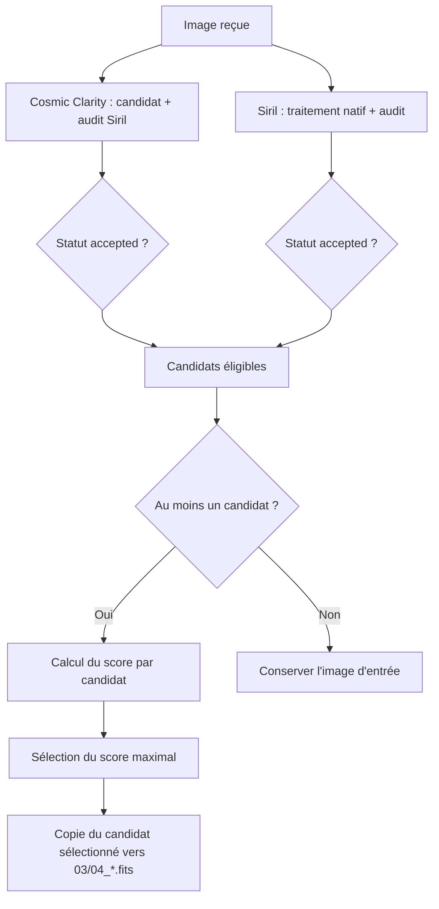

# Cosmic Clarity : moteur neuronal optionnel

[postProcess](README.md) · [Installation](../../INSTALLATION.md)

## Installation et lancement

Le mode comparatif est le défaut. Les étapes 03 (netteté) et 04 (débruitage)
évaluent systématiquement **Cosmic Clarity et Siril**, puis retiennent
automatiquement la meilleure sortie acceptée. Les étapes gradient et
photométrie, ainsi que les options d’activation, restent inchangées.

```bash
# Installation seule : pip système cible le venv choisi par le lanceur.
bin/postProcess.sh --install-cosmic-clarity

# Traitement avec les réseaux, après installation.
bin/postProcess.sh image_RGB.fit rapports/ \
  --enable-clarity --photometry-object M20

# Installation et traitement dans la même commande.
bin/postProcess.sh --install-cosmic-clarity image_RGB.fit \
  --enable-clarity

# Revenir au mode Siril seul.
bin/postProcess.sh image_RGB.fit --disable-clarity
```

`--install-cosmic-clarity` est consommé par le `.sh` : il n'est ni transmis au
script Python ni enregistré dans la configuration. Il installe
`requirements-cosmic-clarity.txt` (PyTorch 2.10.0 CUDA 12.8) et six poids, environ
95 Mo au total. Les bibliothèques CUDA/PyTorch occupent plusieurs Go supplémentaires.
Le téléchargement des modèles ne se produit jamais pendant l'inférence.
Une nouvelle installation vérifie les poids existants et ne retélécharge que
les fichiers manquants ou corrompus. Une erreur interrompt le lancement.

Le dossier par défaut est `models/cosmicclarity/` à la racine du projet, ignoré
par Git. `--cosmic-model-dir /chemin` change le dossier pour l'installation et
le traitement ; ce chemin doit aussi être fourni à l'installation si une
configuration de traitement utilise un dossier personnalisé. Le lanceur ne lit
pas le JSON de configuration pour installer les poids.

Un GPU NVIDIA avec pilote compatible CUDA 12.8 est requis par défaut. Le module
`torch` vérifie CUDA au lancement ; il n'y a pas de repli silencieux vers le CPU.
`--cosmic-device cpu` autorise explicitement une exécution CPU. Siril 1.4 reste
nécessaire pour les mesures stellaires, même avec les réseaux. Le traitement
reste local, sans service distant ni entraînement.

Les sorties de `postProcess` sont regroupées par exécution sous le nom
`<image>_postprocess_<backend>`. Avec ce backend, on obtient donc par défaut :

- dossier d’étapes : `<image>_postprocess_cosmic-clarity/`
- rapport global : `<image>_postprocess_cosmic-clarity.json`
- FITS final : `<image>_postprocess_cosmic-clarity.fits`

Le rapport et le FITS final restent au même niveau que ce dossier.

## Options

| Option | Défaut | Rôle |
|---|---|---|
| `--enable-clarity` | activé | Active le mode comparatif Cosmic Clarity + Siril |
| `--disable-clarity` | désactivé | Désactive le comparatif et garde Siril seul |
| `--cosmic-model-dir` | `<projet>/models/cosmicclarity` | Poids locaux vérifiés |
| `--cosmic-device` | `cuda` | `cuda` ou `cpu` |
| `--cosmic-stellar-amount` | `0.5` | Mélange stellaire, entre 0 et 1 |
| `--cosmic-nonstellar-amount` | `0.5` | Mélange des structures diffuses, entre 0 et 1 |
| `--cosmic-nonstellar-radius` | `3.0` | Rayon en pixels, entre 1 et 8 |
| `--cosmic-denoise-amount` | `0.5` | Mélange du débruitage, entre 0 et 1 |
| `--cosmic-sharpen-mode` | `luminance` | Netteté sur Y ; `separate` traite R/V/B séparément |
| `--cosmic-denoise-mode` | `luminance` | `luminance`, `full` (Y + chrominance guidée), `separate` |
| `--cosmic-color-denoise-amount` | intensité du débruitage | Intensité Cb/Cr en mode `full`, de 0 à 1 |
| `--deconvolution-force-manual-matching` | `false` | Force les seuils manuels d’appariement au lieu du mode auto |

Les options Python respectent CLI > configuration JSON > défauts et ne sont
sauvegardées qu'avec `-S`. `--disable-deconvolution` et `--disable-denoise`
s'appliquent aussi aux réseaux. Les seuils `--deconvolution-min-gain`,
`--deconvolution-max-noise`, `--deconvolution-max-rings`, les réglages
d'appariement, `--deconvolution-layer`, `--deconvolution-output` et
`--denoise-max-blur` restent actifs. Les paramètres du solveur Siril (`iterations`,
`psf-size`, `psf-method`, `alpha`, `step`, `adaptive`, etc.) et
`--denoise-modulation` n'agissent pas sur les réseaux.

En netteté (`03_deconvolution`), les seuils d’appariement stellaires sont
automatiques par défaut : ils sont estimés depuis le catalogue `before.tsv`
(rayon en fonction de la FWHM médiane, volume minimal et fraction minimale
selon la densité d’étoiles valides). Pour conserver des seuils fixes, fournir
les valeurs manuelles et ajouter `--deconvolution-force-manual-matching`.
Sans cette option de forçage, les valeurs manuelles d’appariement ne
remplacent pas le mode auto.

Une intensité nulle désactive le calcul correspondant, mais ne dispense pas des
contrôles d'acceptation : une netteté inchangée ne peut pas satisfaire le gain
minimal demandé. Le débruitage sans amélioration rend l'image précédente.

## Déroulé comparatif des étapes 03 et 04

Quand Clarity est activé, chaque étape de restauration lance deux évaluations :

1. **Cosmic Clarity** produit un candidat (`candidate.fits`) puis exécute
   exactement les mêmes mesures stellaires Siril que le pipeline classique.
2. **Siril** exécute l’algorithme natif correspondant (déconvolution ou
   débruitage) avec ses paramètres usuels.
3. Les deux rapports sont stockés dans `evaluations.cosmic_clarity` et
   `evaluations.siril` avec leurs statuts, mesures et motifs de rejet.
4. Le pipeline garde uniquement les candidats au statut `accepted`, calcule un
   score de sélection, puis retient le meilleur score.
5. Si aucun candidat n’est accepté :
   - étape 03 → statut `no_safe_improvement` ;
   - étape 04 → statut `rejected` ;
   et l’image d’entrée de l’étape est conservée.

Le journal de niveau `INFO` indique, pour la déconvolution et le débruitage,
le début puis le verdict de chaque évaluation **Cosmic Clarity** et **Siril**.
Il affiche les motifs de rejet ou d’échec, les FWHM moyennes en pixels,
les gains de finesse moyen et médian apparié, la variation maximale du bruit
et la fraction maximale d’étoiles avec nouveaux anneaux lorsque ces mesures
sont disponibles. Chaque candidat accepté reçoit un score affiché (plus élevé
= meilleur). Une ligne `choix final` donne le moteur retenu, son score, le
nombre de candidats acceptés et le chemin de sortie ; sans candidat accepté,
elle indique que l’image d’entrée est conservée.

Un échec local du repli de déconvolution Siril, notamment une PSF Moffat
avec trop peu d’étoiles admissibles, conserve le candidat Cosmic Clarity dans
la sélection. Le rapport `evaluations.siril` garde les essais numérotés et
leurs erreurs ; si Siril n’a aucun essai accepté, son statut est
`no_safe_improvement`.



### Score de sélection utilisé

Le score sert uniquement à départager les candidats déjà `accepted`.

- **Netteté (03)** : favorise le gain de finesse et pénalise bruit/anneaux.
  `score = 2*mean_gain + 2*ratio_gain - 0.2*noise_penalty - 0.2*ring_penalty`
- **Débruitage (04)** : favorise la baisse de bruit et pénalise flou/anneaux.
  `score = (1 - max_noise_ratio) - 0.5*blur_penalty - 0.2*ring_penalty`

En cas d’égalité stricte de score, le tri conserve l’ordre d’évaluation :
Cosmic Clarity précède Siril et est donc retenu entre deux candidats équivalents.

## Modules et algorithme

- `lib/cosmic_clarity/models.py` installe les fichiers décrits dans `models.json`
  via HTTPS, dans un fichier temporaire, puis vérifie taille et SHA-256 avant
  remplacement atomique. L'inférence vérifie aussi chaque fichier chargé.
- `color.py` fournit les conversions YCbCr et le filtre guidé des
  [modes couleur](cosmic-color.md), sans PyTorch.
- `network.py` contient les architectures compatibles avec les poids amont,
  avec connexions résiduelles et latérales. Les paramètres sont chargés
  strictement par PyTorch avec `weights_only=True`.
- `inference.py` fournit `CosmicClarityEngine.process(source, destination,
  operation, ...)`, écrit un candidat FITS distinct et retourne ses paramètres.
- `processors.py` fournit `CosmicClaritySharpenProcessor` et
  `CosmicClarityDenoiseProcessor`. Ces classes produisent le candidat, lancent
  les mesures Siril et décident si l'image peut être transmise à l'étape suivante.

Les données FITS mono ou RGB sont calculées en float32. Les entiers
sont divisés par leur maximum représentable, comme dans les contrôles Siril,
et la sortie float32 conserve cette échelle normalisée. Pour les autres données, si
nécessaire, une translation et une échelle communes placent les pixels dans
[0,1] ; elles sont inversées en sortie pour conserver l’échelle des flottants. Les fichiers
CFA, les dimensions incompatibles, les pixels non finis et les images constantes
sont refusés. Les autres HDU et les métadonnées sont conservés.

Les modes couleur suivent les scripts AI3 de l’auteur : **luminance** par
défaut pour la netteté et le débruitage en ligne de commande ; traitement des
canaux séparés en option ; débruitage `full` combinant réseau sur Y et filtre
guidé sur Cb/Cr. Le réseau reçoit une luminance ou un canal dupliqué trois fois,
comme chez l’auteur, et son premier canal de sortie est retenu. Le mode `full`
n’envoie pas le RGB complet au réseau.
Voir [modes couleur et prétraitement](cosmic-color.md) pour les conversions,
formules, paramètres, interfaces et limites de fidélité.

Le réseau travaille sur des tuiles de 256 × 256 pixels, avec recouvrement de
64 pixels. Une marge de 16 pixels est écartée sur chaque prédiction et les
recouvrements valides sont moyennés. Une bordure ajoutée à l'image assure la
couverture de tous ses pixels ; le dernier morceau est complété avant inférence.
Un seul lot est envoyé au GPU, et les réseaux sont chargés successivement.
La RAM contient néanmoins plusieurs tableaux à la taille de l'image.

La netteté applique d'abord le modèle stellaire, puis les modèles non stellaires
encadrant le rayon choisi parmi 1, 2, 4 et 8. Leurs sorties sont interpolées
linéairement. Chaque intensité `a` mélange l'entrée et la prédiction :
`sortie = (1 - a) entrée + a prédiction`. Le débruitage utilise le poids AI3.6.

Cette adaptation reprend les modes luminance/chrominance de la révision AI3
référencée, avec un rayon fixe et float32. Elle ne reproduit pas l’auto-PSF
locale, les interfaces graphiques ni toutes les variantes de l’application.
Les statistiques de bord et l’ordre de padding/étirement diffèrent encore de
l’amont ; il ne s’agit pas d’une reproduction pixel à pixel de l’exécutable.
Elle ne charge pas les modèles AI4 de Suite Pro.

## Contrôles et limites

La netteté exige les mêmes mesures que la déconvolution Siril : étoiles appariées,
gain de finesse, bruit et anneaux acceptables. Le pipeline calcule ces mesures
pour Cosmic Clarity et Siril, puis choisit la sortie acceptée au score le plus
favorable. Si les deux sont rejetées, l’étape retourne `no_safe_improvement` et
conserve l’image d’entrée. Le débruitage applique la même logique comparative
avec `assess_denoising`; si les deux sorties sont rejetées, l’image reçue est
conservée. Un incident technique ou des mesures impossibles font échouer l'étape.

Les rapports `03_deconvolution.json` et `04_denoise.json` indiquent le moteur,
le périphérique, la version de PyTorch, les empreintes des poids utilisés,
les réglages, les mesures et les motifs de rejet. Chaque dossier de travail
conserve le candidat, le script et les catalogues de contrôle. Pour les étapes
03 et 04, les dossiers parents `03_deconvolution_work/` et `04_denoise_work/`
sont supprimés avant calcul puis recréés avec un sous-dossier ordonné `001/`.
Une ancienne sortie acceptée n'est pas remplacée par un candidat rejeté.

Ces contrôles ne prouvent pas la conservation de structures diffuses ou des flux
photométriques. La validation sur des FITS astronomiques avec Siril et inspection
visuelle reste nécessaire avant de préférer ce moteur au traitement classique.

## Vérification reproductible

Tests sans téléchargement des poids :

```bash
.venv/bin/python -m pytest -q tests/test_cosmic_clarity.py tests/test_cosmic_inference.py
```

Les tests d'inférence sont ignorés si PyTorch n'est pas installé. Après
installation, ce test charge les six vrais poids sur CUDA puis traite un FITS
synthétique avec les deux opérations :

```bash
COSMIC_CUDA_TEST=1 .venv/bin/python -m pytest -q tests/test_cosmic_inference.py
```

`COSMIC_MODEL_DIR` peut désigner un autre dossier pour ce test. Celui-ci vérifie
la compatibilité des checkpoints, les dimensions et la finitude des sorties,
ainsi que la préservation de l'entrée ; il ne constitue pas un test de qualité
astronomique ni une validation de bout en bout avec Siril.

## Provenance

Architectures et pré/post-traitements adaptés du dépôt
[setiastro/cosmicclarity](https://github.com/setiastro/cosmicclarity/tree/423acc442724872ff6d81011962a8cbf5744a7f7),
commit `423acc442724872ff6d81011962a8cbf5744a7f7`. La licence MIT de Franklin
Marek est conservée dans `lib/cosmic_clarity/LICENSE`. Les poids proviennent de
la [publication Linux officielle](https://github.com/setiastro/cosmicclarity/releases/tag/Linux),
avec des empreintes figées dans le manifeste du projet. Les scripts d'interface
Siril, sous une autre licence, ne sont pas incorporés.
